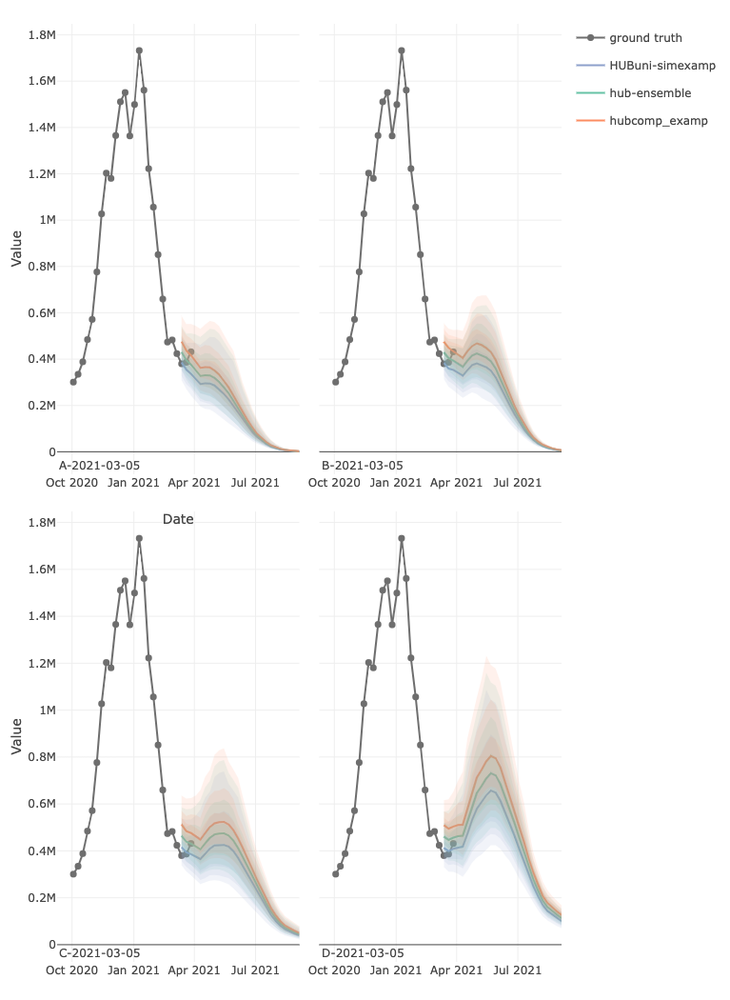

# hubVis <a href="https://hubverse-org.github.io/hubVis/"></a>

[](https://lifecycle.r-lib.org/articles/stages.html#experimental)
[](https://github.com/hubverse-org/hubVis/actions/workflows/R-CMD-check.yaml)
[](https://app.codecov.io/gh/hubverse-org/hubVis?branch=main)

The goal of hubVis is to provide plotting methods for hub model outputs,
following the hubverse format. The hubverse is a collection of open-source
software and data tools, developed by the Consortium of Infectious Disease
Modeling Hubs. For more information, please consult the
[hubDocs](https://docs.hubverse.io/en/latest/) website

## Installation

### Latest

You can install the [latest version of hubVis from the R-universe](https://hubverse-org.r-universe.dev/hubVis):

```r
install.packages("hubVis", repos = c("https://hubverse-org.r-universe.dev", "https://cloud.r-project.org"))
```

### Development

If you want to test out new features that have not yet been released, you can install the development version of hubVis from [GitHub](https://github.com/) with:

```r
remotes::install_github("hubverse-org/hubVis")
```

## Usage

The R package contains currently one function `plot_step_ahead_model_output()`
plotting 50%, 80%, and 95% quantiles intervals, with a specific color per
"model\_id".

The function can output 2 types of plots:

- interactive (Plotly object)
- static (ggplot2 object)

```r
library(hubVis)
```

```r
library(hubExamples)
head(scenario_outputs)
head(scenario_target_ts)
projection_data <- dplyr::mutate(scenario_outputs,
     target_date = as.Date(origin_date) + (horizon * 7) - 1)

target_data_us <- dplyr::filter(scenario_target_ts, location == "US",
                                date < min(projection_data$target_date) + 21,
                                date > "2020-10-01")
```

```r
projection_data_us <- dplyr::filter(projection_data,
                                    scenario_id == "A-2021-03-05",
                                    location == "US")
plot_step_ahead_model_output(projection_data_us, target_data_us)
```


Faceted plots can be created for multiple scenarios, locations, targets,
models, etc.

```r
projection_data_us <- dplyr::filter(projection_data,
                                    location == "US")
plot_step_ahead_model_output(projection_data_us, target_data_us, 
                             use_median_as_point = TRUE,
                             facet = "scenario_id", facet_scales = "free_x", 
                             facet_nrow = 2, facet_title = "bottom left")
```



***

## Code of Conduct

Please note that the hubVis package is released with a [Contributor Code of Conduct](.github/CODE_OF_CONDUCT.md). By contributing to this project, you agree to abide by its terms.

## Contributing

Interested in contributing back to the open-source Hubverse project?
Learn more about how to [get involved in the Hubverse Community](https://docs.hubverse.io/en/latest/overview/contribute.html) or [how to contribute to the hubVis package](.github/CONTRIBUTING.md).


