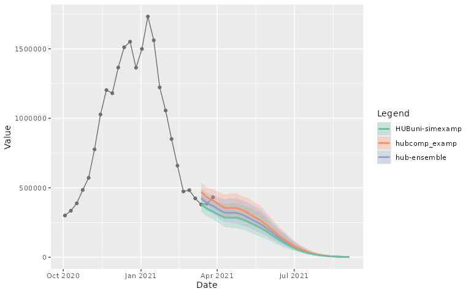
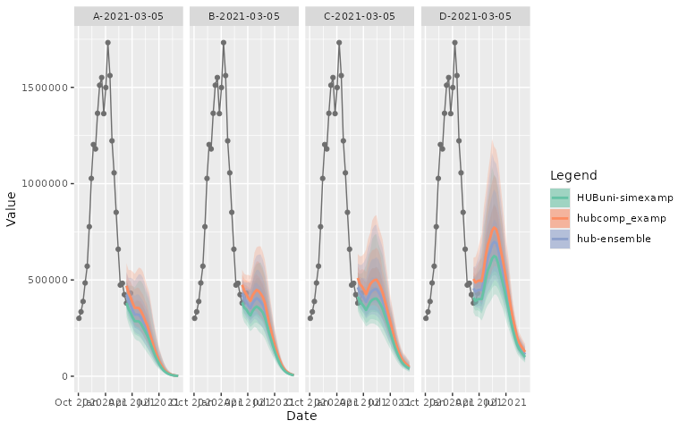
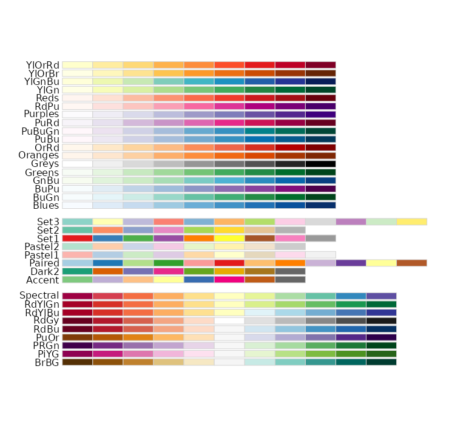
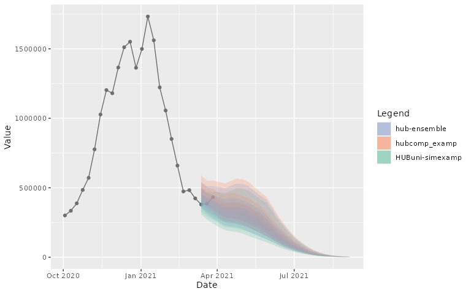

# Plot Model Projections Output

The `hubVis` package contains a function called
[`plot_step_ahead_model_output()`](https://hubverse-org.github.io/hubVis/dev/reference/plot_step_ahead_model_output.md)
that can be used to plot model output that is in the format of forecasts
or projects that look multiple horizons into the future.

This function plots forecasts/scenario quantiles, median and samples
projections and optional target data. Faceted plots can be created for
multiple scenarios, locations, forecast dates, models, etc. Currently,
the function can plot only quantile data, with the possibility to add
“median” information from the model projections.

For more information about the Hubverse standard format, please refer to
the [HubDocs
website](https://docs.hubverse.io/en/latest/user-guide/tasks.html).

The following vignette describes the principal usage of the
[`plot_step_ahead_model_output()`](https://hubverse-org.github.io/hubVis/dev/reference/plot_step_ahead_model_output.md)
function.

``` r

library(hubVis)
library(hubData)
```

Plots are available in two output formats:

- “interactive” format: a [Plotly](https://plotly.com) output object
  with interactive legend, hover text, zoom-in and zoom-out options,
  etc.
- “static” format: a [ggplot2](https://ggplot2.tidyverse.org/) output
  object. By default, the output plot is “interactive”, but it can be
  changed to “static” by setting the `interactive` parameter to FALSE.
  See end of the document for examples.

## Load and Filter Data

To demonstrate the functionality of the
[`plot_step_ahead_model_output()`](https://hubverse-org.github.io/hubVis/dev/reference/plot_step_ahead_model_output.md)
function, we will use the examples data from the
[hubExamples](https://github.com/hubverse-org/hubExamples) package.

#### Forecast

- `forecast_outputs`: example cdf, mean, median, pmf, quantile, and
  sample forecast data that represents model outputs from a forecast hub
  with predictions for three influenza-related targets (wk inc flu hosp,
  wk flu hops rate category, and wk flu hosp rate) for two reference
  dates in 2022.

- `forecast_target_ts`: contains time series target data associated with
  the forecast projection data.

#### Scenario

- `scenario_outputs`: example quantile scenario projection data that
  represents model outputs and an ensemble (generated with
  `hubEnsemble`) from a scenario hub with predictions for one target
  (`inc hosp`) in one location (`"US"`), one round (“2021-03-07”) and
  four scenarios.

- `scenario_target_ts`: contains time series target data associated with
  the scenario projection data.

### Load data

``` r

# Data are also available in the HubExamples package
# library(hubExamples)

# Scenario examples
head(scenario_outputs)
#> # A tibble: 6 × 9
#>   model_id        origin_date scenario_id  location target   horizon output_type
#>   <chr>           <date>      <chr>        <chr>    <chr>      <int> <chr>      
#> 1 HUBuni-simexamp 2021-03-07  A-2021-03-05 US       inc case       1 quantile   
#> 2 HUBuni-simexamp 2021-03-07  A-2021-03-05 US       inc case       1 quantile   
#> 3 HUBuni-simexamp 2021-03-07  A-2021-03-05 US       inc case       1 quantile   
#> 4 HUBuni-simexamp 2021-03-07  A-2021-03-05 US       inc case       1 quantile   
#> 5 HUBuni-simexamp 2021-03-07  A-2021-03-05 US       inc case       1 quantile   
#> 6 HUBuni-simexamp 2021-03-07  A-2021-03-05 US       inc case       1 quantile   
#> # ℹ 2 more variables: output_type_id <dbl>, value <dbl>
head(scenario_target_ts)
#> # A tibble: 6 × 4
#>   location date       observation target  
#>   <chr>    <chr>            <int> <chr>   
#> 1 US       2020-10-03      300678 inc case
#> 2 US       2020-10-10      334493 inc case
#> 3 US       2020-10-17      388282 inc case
#> 4 US       2020-10-24      484422 inc case
#> 5 US       2020-10-31      571389 inc case
#> 6 US       2020-11-07      776479 inc case

# Forecast examples
head(forecast_outputs)
#> # A tibble: 6 × 9
#>   model_id    reference_date target horizon location target_end_date output_type
#>   <chr>       <date>         <chr>    <int> <chr>    <date>          <chr>      
#> 1 Flusight-b… 2022-11-19     wk in…       0 25       2022-11-19      quantile   
#> 2 Flusight-b… 2022-11-19     wk in…       0 25       2022-11-19      quantile   
#> 3 Flusight-b… 2022-11-19     wk in…       0 25       2022-11-19      quantile   
#> 4 Flusight-b… 2022-11-19     wk in…       0 25       2022-11-19      quantile   
#> 5 Flusight-b… 2022-11-19     wk in…       0 25       2022-11-19      quantile   
#> 6 Flusight-b… 2022-11-19     wk in…       0 25       2022-11-19      quantile   
#> # ℹ 2 more variables: output_type_id <chr>, value <dbl>
head(forecast_target_ts)
#> # A tibble: 6 × 4
#>   target_end_date target          location observation
#>   <date>          <chr>           <chr>          <dbl>
#> 1 2020-01-11      wk inc flu hosp 01                 0
#> 2 2020-01-11      wk inc flu hosp 15                 0
#> 3 2020-01-11      wk inc flu hosp 18                 0
#> 4 2020-01-11      wk inc flu hosp 27                 0
#> 5 2020-01-11      wk inc flu hosp 30                 0
#> 6 2020-01-11      wk inc flu hosp 37                 0
```

### Data Preparation

The forecast and scenario output should be a `model_out_tbl`. In
addition to the standard requirements for this class, the
[`plot_step_ahead_model_output()`](https://hubverse-org.github.io/hubVis/dev/reference/plot_step_ahead_model_output.md)
function in `hubVis` has other requirement.

- a Date column used for the x-axis of a “step ahead” plot. By default,
  the function expect a `"target_date"` column, although this could be
  over-ridden by specifying a different column using the `x_col_name`
  argument.
- `quantile`, `sample`, and `median` are the only accepted output type

``` r

# Add a `target_date` column in the scenario example
projection_data <- dplyr::mutate(scenario_outputs,
                                 target_date = as.Date(origin_date) +
                                   (horizon * 7) - 1)
head(projection_data)
#> # A tibble: 6 × 10
#>   model_id        origin_date scenario_id  location target   horizon output_type
#>   <chr>           <date>      <chr>        <chr>    <chr>      <int> <chr>      
#> 1 HUBuni-simexamp 2021-03-07  A-2021-03-05 US       inc case       1 quantile   
#> 2 HUBuni-simexamp 2021-03-07  A-2021-03-05 US       inc case       1 quantile   
#> 3 HUBuni-simexamp 2021-03-07  A-2021-03-05 US       inc case       1 quantile   
#> 4 HUBuni-simexamp 2021-03-07  A-2021-03-05 US       inc case       1 quantile   
#> 5 HUBuni-simexamp 2021-03-07  A-2021-03-05 US       inc case       1 quantile   
#> 6 HUBuni-simexamp 2021-03-07  A-2021-03-05 US       inc case       1 quantile   
#> # ℹ 3 more variables: output_type_id <dbl>, value <dbl>, target_date <date>
```

## Plot

The plotting function requires only 2 parameters:

- `model_out_tbl`: [a `model_out_tbl`
  object](https://hubverse-org.github.io/hubUtils/articles/connect_hub.html#structure-of-hubverse-datasets)
  containing all the Hubverse standard columns, including a date
  column`and`“model_id”\` columns.

- `target_data`: a `data.frame` object containing the target data,
  including the columns: a date column and `"observation"`.

We strongly advice to filter both inputted data frame to select only the
rows of interest in the plot.

The function can plot three model output type: `"quantile"`, `"sample"`,
and `"median"`. Any other additional output type will be filtered out
and a warning will be issued. The two parameters: `intervals` and
`use_median_as_point` can be used to decide what output type to plot:

- `intervals`:
  - a vector of `numeric` values indicating which central prediction
    interval levels to plot using `"quantile"` output type. If no
    quantile is available in the `model_out_tbl` object and if
    `"sample"` are present, the samples will be used to calculate the
    required quantiles. Value possibles: `0.5`, `0.8`, `0.9`, `0.95`
  - `NULL` can be used to indicate to plot the `"sample"` output type in
    a spaghetti plot.
  - By default, the `intervals` parameter is set to `c(.5, .8, .95)` and
    expect `"quantile"` or `"sample"`output type in the `model_out_tbl`
    object
- `use_median_as_point`:
  - Boolean to indicate to plot the median. If the `model_out_tbl`
    contains `"median"` output type, it will be used preferably. If not
    available, the `"quantile"`, value `0,5` will be used. And if both
    are unavaiable, the `"sample"` output type can be used to calculate
    the median.

### “Simple” plot

#### Forecast

To plot the forecast projections for one reference dates (2022-11-19)
for Massachusetts (25).

``` r

# Pre-filtering
forecast_quantile <- dplyr::filter(forecast_outputs,
                                   output_type == "quantile",
                                   reference_date == "2022-11-19",
                                   location == 25) |>
  dplyr::mutate(output_type_id = as.numeric(output_type_id))

# Limit date for layout reason
forecast_target_ma <- dplyr::filter(forecast_target_ts, location == 25,
                                    target == "wk inc flu hosp",
                                    target_end_date >= "2022-11-01",
                                    target_end_date <= "2023-01-01")
```

As the forecast projections used the column `target_end_date` for date
column and contains the quantiles: `"0.05"`, `"0.1"`, `"0.25"`, `"0.5"`,
`"0.75"`, `"0.9"`, `"0.95"`, the parameters in the
[`plot_step_ahead_model_output()`](https://hubverse-org.github.io/hubVis/dev/reference/plot_step_ahead_model_output.md)
needs to be ajusted:

``` r

plot_step_ahead_model_output(forecast_quantile, forecast_target_ma,
                             intervals = c(0.9, 0.5),
                             x_col_name = "target_end_date",
                             x_target_col_name = "target_end_date")
```

The median can be added to the plot:

``` r

plot_step_ahead_model_output(forecast_quantile, forecast_target_ma,
                             intervals = c(0.9, 0.5),
                             use_median_as_point = TRUE,
                             x_col_name = "target_end_date",
                             x_target_col_name = "target_end_date")
```

##### Samples Output Type

By setting the `intervals` parameter to `NULL`, the
[`plot_step_ahead_model_output()`](https://hubverse-org.github.io/hubVis/dev/reference/plot_step_ahead_model_output.md)
function will plot the `"sample"` output type in a spaghetti plot

``` r

forecast_sample <- dplyr::filter(forecast_outputs, output_type == "sample",
                                 reference_date == "2022-11-19",
                                 location == 25)
```

``` r

plot_step_ahead_model_output(forecast_sample, forecast_target_ma,
                             intervals = NULL,
                             x_col_name = "target_end_date",
                             x_target_col_name = "target_end_date")
```

Same as `"quantile"` output type, a median can be added to the plot by
using the `use_median_as_point = TRUE` parameter. The median is plotted
either by using the `"median"` output type in the inputted data frame or
the `"quantile"` 0.5 or the function calculate it by using the
`"sample"`, depending on the content of the inputted data frame

``` r

forecast_sample <- dplyr::filter(forecast_outputs, output_type %in%
                                   c("sample", "median"),
                                 reference_date == "2022-11-19",
                                 location == 25)
plot_step_ahead_model_output(forecast_sample, forecast_target_ma,
                             intervals = NULL, use_median_as_point = TRUE,
                             x_col_name = "target_end_date",
                             x_target_col_name = "target_end_date")
```

The rest of the vignette is using `"quantile"` output type to show the
multiple functionality of
[`plot_step_ahead_model_output()`](https://hubverse-org.github.io/hubVis/dev/reference/plot_step_ahead_model_output.md).
The same functionality is also available for spaghetti plots using
`"sample"` output type.

#### Scenario

To plot the model projections for the US, Scenario A:

``` r

# Pre-filtering
projection_data_a_us <- dplyr::filter(projection_data,
                                      scenario_id == "A-2021-03-05",
                                      location == "US")

# Limit date for layout reason
target_data_us <-
  dplyr::filter(scenario_target_ts, location == "US",
                date < min(projection_data$target_date) + 21,
                date > "2020-10-01")
```

By default, the function will plot the quantiles intervals:

``` r

projection_plot <- dplyr::filter(projection_data_a_us, output_type == "quantile")
plot_step_ahead_model_output(projection_plot, target_data_us)
```

By default, the 50%, 80% and 95% intervals are plotted, with a specific
color palette per `model_id`.

In general, it is hard to see multiple intervals when multiple models
are plotted, so specifying only one interval can be useful:

``` r

plot_step_ahead_model_output(projection_plot, target_data_us,
                             intervals = 0.8)
```

It is also possible to add a median line on the plot with the
`use_median_as_point` parameter:

``` r

plot_step_ahead_model_output(projection_plot, target_data_us,
                             intervals = 0.8,
                             use_median_as_point = TRUE)
```

By default plots are interactive, but that can be easily switched to
static:

``` r

plot_step_ahead_model_output(projection_plot, target_data_us,
                             intervals = 0.8,
                             use_median_as_point = TRUE,
                             interactive = FALSE)
```



### Facet plot

#### Scenario

A “facet” (or subplot) plot can also be created for each scenario

``` r

# Pre-filtering
projection_data_us <- dplyr::filter(projection_data,
                                    location == "US")
```

``` r

plot_step_ahead_model_output(projection_data_us, target_data_us,
                             facet = "scenario_id")
```

The layout of the “facets” can be adjusted, with the different `facet_`
parameters.

``` r

plot_step_ahead_model_output(projection_data_us, target_data_us,
                             use_median_as_point = TRUE,
                             facet = "scenario_id", facet_scales = "free_x",
                             facet_nrow = 2, facet_title = "bottom left")
```

Or with the additional `facet_ncol` parameter for the statics plot

``` r

plot_step_ahead_model_output(projection_data_us, target_data_us,
                             use_median_as_point = TRUE, interactive = FALSE,
                             facet = "scenario_id", facet_scales = "free_x",
                             facet_ncol = 4, facet_title = "bottom left")
```



A “facet” (or subplot) plot can also be created for each model. In this
case, the legend will be adapted to return the `model_id` value.

``` r

plot_step_ahead_model_output(projection_data_a_us, target_data_us,
                             facet = "model_id")
```

The legend can be removed with the parameter `show_legend = FALSE`.

``` r

plot_step_ahead_model_output(projection_data_a_us, target_data_us,
                             facet = "model_id", show_legend = FALSE)
```

#### Forecast

A “facet” (or subplot) plot can also be created for each location

``` r

forecast_quantile_1 <- dplyr::filter(forecast_outputs,
                                     reference_date == "2022-11-19",
                                     output_type == "quantile") |>
  dplyr::mutate(output_type_id = as.numeric(output_type_id))
forecast_target <- dplyr::filter(forecast_target_ts,
                                 target_end_date >= "2022-11-01",
                                 target_end_date <= "2023-01-01",
                                 target == "wk inc flu hosp",
                                 location %in% forecast_quantile_1$location)
```

``` r

plot_step_ahead_model_output(forecast_quantile_1, forecast_target,
                             intervals = c(0.9, 0.5),
                             use_median_as_point = TRUE,
                             x_col_name = "target_end_date",
                             x_target_col_name = "target_end_date",
                             facet = "location")
```

### Intervals

By default, the 50%, 80% and 95% intervals are plotted. However, it is
possible to also plot the 90% intervals or a subset of these intervals.
When plotting 6 or more models, the plot will be reduced to show the
widest intervals provided (95% by default).

To illustrate this we will use the projections for only one model in the
scenario example

``` r

# Pre-filtering
projection_data_mod <- dplyr::filter(projection_data,
                                     location == "US",
                                     model_id == "hub-ensemble")
```

``` r

plot_step_ahead_model_output(projection_data_mod, target_data_us,
                             use_median_as_point = TRUE, facet = "scenario_id",
                             facet_nrow = 2, intervals = c(0.5, 0.8, 0.9, 0.95))
```

The opacity of the intervals can be adjusted:

``` r

plot_step_ahead_model_output(projection_data_mod, target_data_us,
                             use_median_as_point = TRUE, facet = "scenario_id",
                             facet_nrow = 2, intervals = c(0.5, 0.8, 0.9, 0.95),
                             fill_transparency = 0.15)
```

Plots without intervals are also possible (if no `"sample"` is
available). A warning will be printed for the missing samples:

``` r

plot_step_ahead_model_output(projection_data_mod, target_data_us,
                             use_median_as_point = TRUE, facet = "scenario_id",
                             facet_nrow = 2, intervals = NULL)
#> Warning: ! `plot_set_ahead_model_output()` was expecting "sample" output_type due to
#>   `intervals` set to `NULL`. `model_out_tbl` is missing the output_type
#>   "sample". No intervals or samples will be plotted.
```

### Other parameters

Several other parameters are available to update the plot output. Here
is some examples of some parameters.

#### “Ensemble” layout

It is possible to assign a specific color and behavior to a specific
`model_id`. Typically, this is done to highlight an ensemble, so the
name for these arguments are `ens_name` and `end_color`. The model
specified by `ens_name` will be the top layer of the resulting plot.

``` r


plot_step_ahead_model_output(projection_data_us, target_data_us,
                             use_median_as_point = TRUE,
                             facet = "scenario_id", facet_nrow = 2,
                             ens_name = "hub-ensemble", ens_color = "black",
                             intervals = 0.8)
```

#### “Group” layout

An optional parameter `group` in the
[`plot_step_ahead_model_output()`](https://hubverse-org.github.io/hubVis/dev/reference/plot_step_ahead_model_output.md)
function to allow to group or partition the input data in the plot
according to a specific column. Please refer to
[`ggplot2::aes_group_order`](https://ggplot2.tidyverse.org/reference/aes_group_order.html)
for more information.

To illustrate this we will use the forecast example for both reference
date:

``` r

forecast_out <- dplyr::filter(forecast_outputs, output_type %in%
                                c("quantile", "median")) |>
  dplyr::mutate(output_type_id = as.numeric(output_type_id))
plot_step_ahead_model_output(forecast_out, forecast_target,
                             intervals = c(0.9, 0.5),
                             use_median_as_point = TRUE,
                             x_col_name = "target_end_date",
                             x_target_col_name = "target_end_date",
                             facet = "location",
                             group = "reference_date")
```

#### Log scale

An optional Boolean parameter `log_scale` is available in the
[`plot_step_ahead_model_output()`](https://hubverse-org.github.io/hubVis/dev/reference/plot_step_ahead_model_output.md)
function to plot the y-values of all inputs (model output and target
data) on a log scale.

``` r

plot_step_ahead_model_output(projection_data_us, target_data_us,
                             facet = "scenario_id", facet_nrow = 2,
                             use_median_as_point = TRUE, log_scale = TRUE)
```

#### Layout update

Multiple layout update are possible:

- Not showing the target data in the plot:

``` r

plot_step_ahead_model_output(projection_data_a_us, target_data_us,
                             plot_target = FALSE)
```

- Change the top layer to the target data:

``` r

plot_step_ahead_model_output(projection_data_a_us, target_data_us,
                             top_layer = "target")
```

- Add a title to the plot:

``` r

plot_step_ahead_model_output(projection_data_a_us, target_data_us,
                             title = "Incident Cases in the US")
```

- Change palette color and behavior:
  - The default palette can be changed. All the available palette names
    are available here:

``` r

RColorBrewer::display.brewer.all()
```



``` r

plot_step_ahead_model_output(projection_data_a_us, target_data_us,
                             pal_color = "Dark2")
```

- By default, separate colors will be used for each model.

The `fill_by` parameter can be change to another valid column names to
change the legend and colors attributes to this new column.

``` r

plot_step_ahead_model_output(projection_data_us, target_data_us,
                             facet = "model_id", fill_by = "scenario_id")
```

It is possible to use only blues for all models, by setting the
`pal_color` parameter to `NULL`. This might be especially useful when
used for many models in conjunction with highlighting the ensemble
forecast using the `ens_name` and `ens_color` argument.

``` r

plot_step_ahead_model_output(projection_data_a_us, target_data_us,
                             intervals = 0.8,
                             ens_name = "hub-ensemble", ens_color = "black",
                             pal_color = NULL, use_median_as_point = TRUE)
```

The default blue color can be changed with the `one_color` parameter

``` r

plot_step_ahead_model_output(projection_data_a_us, target_data_us,
                             intervals = 0.8, one_color = "orange",
                             ens_name = "hub-ensemble", ens_color = "black",
                             pal_color = NULL, use_median_as_point = TRUE)
```

- Interactive/Static plot:

``` r

plot_step_ahead_model_output(projection_data_a_us, target_data_us,
                             interactive = FALSE)
```



- Column Names:

The input data frames can have different column names for the date
information. In this case, the two `x_col_name` and `x_target_col_name`
parameters can be used to indicate the variables that should be mapped
to the x-axis.

``` r

names(target_data_us)[names(target_data_us) == "date"] <- "time"
names(projection_data_a_us)[names(projection_data_a_us) == "target_date"] <-
  "date"
plot_step_ahead_model_output(projection_data_a_us, target_data_us,
                             x_col_name = "date", x_target_col_name = "time")
```

For other parameters, please consult the documentation associated with
the function:
[`?plot_step_ahead_model_output`](https://hubverse-org.github.io/hubVis/dev/reference/plot_step_ahead_model_output.md)
